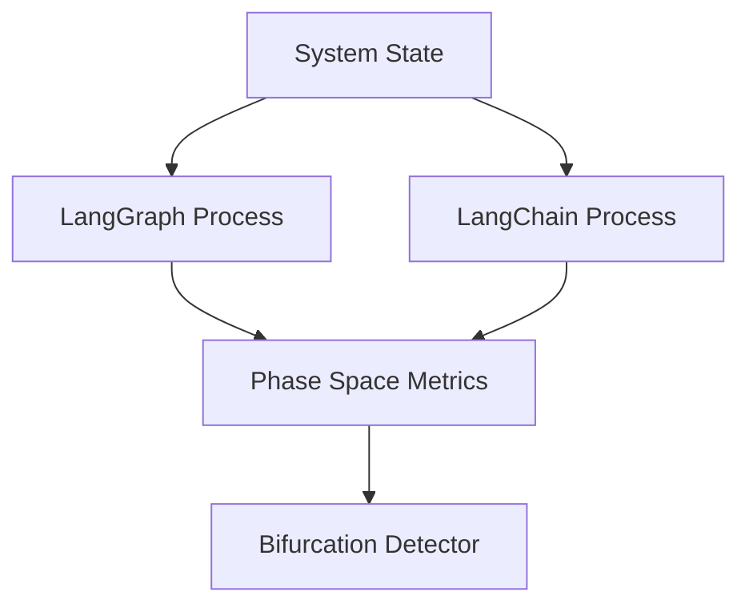

# Phase Space Bifurcation Analysis: LangGraph vs LangChain

## Goal

Create parallel orchestration frameworks using LangGraph and LangChain to model the current multi-agent system and observe how the models bifurcate over phase space.

## Current System State Model

### Core Components

- **WorldModel**: C++ state container (agents, planes, physics)
- **SafetyLayer**: Envelope for action clipping
- **Agents**: Boss, BigBoss, Avatar, Orchestrator
- **Ledger**: Hash-chain for deterministic replay

### Phase Space Dimensions

1. **Agent State**: Position, velocity, health
2. **Decision Trajectory**: Action sequences over time
3. **Safety Violations**: Clip events and constraint breaches
4. **Emergence Metrics**: Kawaii Score, Non-Euclidean Drift

## Proposed Architecture

### Parallel Process Framework

### [NEW] `phase_space/`

#### [NEW] `langgraph_orchestrator.py`

- **StateGraph**: Nodes for each agent (Boss, BigBoss, Avatar)
- **Edges**: Conditional routing based on WorldModel state
- **Checkpointing**: Ledger integration for replay
- **Metrics**: Track decision paths and state transitions

#### [NEW] `langchain_orchestrator.py`

- **Sequential Chain**: Linear agent execution
- **Memory**: ConversationBufferMemory for state persistence
- **Tools**: SafetyLayer as a tool wrapper
- **Metrics**: Same observables as LangGraph for comparison

#### [NEW] `bifurcation_analyzer.py`

- **Parallel Execution**: Run both frameworks on identical inputs
- **Metric Collection**: Capture phase space trajectories
- **Divergence Detection**: Identify where models bifurcate
- **Visualization**: Plot phase space evolution

## Phase Space Metrics

| Metric | Description |
|--------|-------------|
| `decision_entropy` | Shannon entropy of action distributions |
| `trajectory_divergence` | KL divergence between LangGraph/LangChain paths |
| `safety_violation_rate` | Frequency of SafetyLayer clips |
| `emergence_score` | Kawaii Score + Non-Euclidean Drift |

## Implementation Details

### LangGraph Approach

- **Graph-based**: Explicit state machine with conditional edges
- **Parallelism**: Concurrent agent execution where possible
- **Determinism**: Checkpointing ensures reproducibility

### LangChain Approach

- **Sequential**: Linear chain of agent calls
- **Memory-driven**: Relies on conversation history
- **Flexibility**: Easier to add/remove agents dynamically

### Bifurcation Hypothesis

**LangGraph** will exhibit more deterministic, structured trajectories due to explicit state management.
**LangChain** will show higher variance in decision paths due to memory-based context accumulation.

## Verification Plan

### Experiment Protocol

1. Initialize identical WorldModel state
2. Run both orchestrators for N timesteps
3. Collect phase space metrics at each step
4. Compute trajectory divergence
5. Visualize bifurcation points

### Success Criteria

- Both frameworks complete without errors
- Metrics are collected for all timesteps
- Bifurcation points are clearly identified
- Visualization shows phase space evolution
