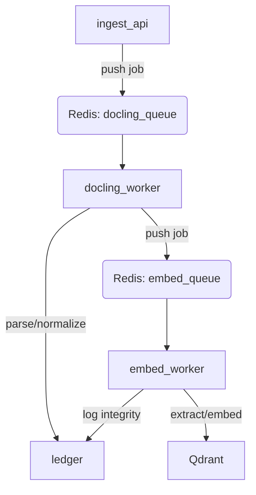

# Docling Cluster - Implementation Plan

## Architecture (Distributed RQ)



## Directory Structure (Qube/)

```text
Qube/docling-cluster/
├── docker-compose.yml
├── lib/               # Shared logic (JCS, hashing)
├── schemas/           # Pydantic models (doc.v1, chunk.v1)
├── services/          # (Optional: grouped services)
├── ingest_api/        # FastAPI + RQ Dispatcher
├── docling_worker/    # RQ Worker for normalization
├── embed_worker/      # RQ Worker for PyTorch embeddings
└── ledger/            # Append-only hash-chain service
```

## Key Components

### 1. Unified Schemas

Located in `schemas/`. Provides strict Pydantic models with JSON aliases for cross-language compatibility.

- `DocNormalizedV1`: Full document structure.
- `ChunkEmbeddingV1`: Text chunk + vector metadata + provenance.

### 2. Integrity Layer

Located in `lib/`.

- **JCS**: Deterministic JSON serialization via `jcs.py`.
- **Hashing**: SHA256 of canonicalized objects (excluding the `integrity` field for self-hashing).

### 3. Vector Storage

**Qdrant** is used for low-latency vector search. The `embed_worker` handles UPSERT operations with metadata (doc_id, chunk_id, etc.).

## Deployment & Verification

- **Local Dev**: `.\scripts\deploy-local.bat` (Requires Docker).
- **Unit Testing**: `jest` and `pytest` for schema and logic validation.
- **System Test**: `test_replay.py` ensures deterministic hashing.
