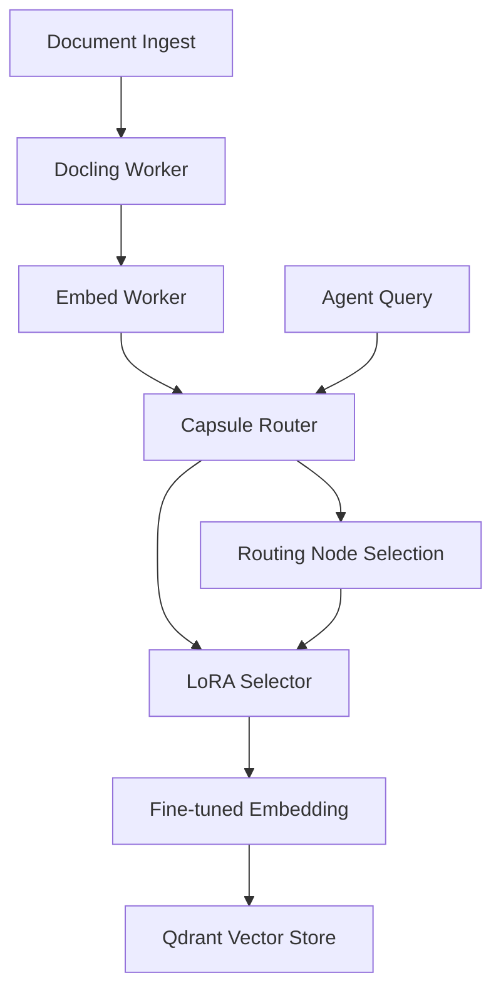

# Implementation Plan: Agent Capsule Model System

## Goal

Build an **Agent Capsule Model** system that serves as foundational routing nodes for embedding vectors, enabling RAG agents to select and apply LoRA weights for real-time fine-tuning.

## Architecture Overview



## Core Concepts

### 1. Capsule Model

A **capsule** is a reusable, composable agent component that encapsulates:

- Base embedding model
- Routing logic (which LoRA to apply)
- State/context for decision-making

### 2. Routing Nodes

**Routing nodes** are decision points that:

- Analyze incoming embedding vectors
- Select appropriate LoRA weights based on context
- Route to specialized fine-tuning paths

### 3. LoRA Weight Registry

A **registry** of Low-Rank Adaptation weights that:

- Stores domain-specific adaptations
- Enables real-time model fine-tuning
- Supports agent remixing and composition

---

## Proposed Changes

### New Service: `capsule-model`

#### [NEW] `Qube/docling-cluster/services/capsule-model/`

**Purpose**: Routing node service that selects LoRA weights for embedding fine-tuning.

**Components**:

- `router.py` — Routing logic for LoRA selection
- `lora_registry.py` — LoRA weight storage and retrieval
- `capsule_api.py` — FastAPI service for agent queries

---

### Schema Extensions

#### [NEW] `schemas/capsule_v1.py`

```python
class CapsuleModel(BaseModel):
    capsule_id: str
    base_model_id: str
    routing_nodes: list[RoutingNode]
    lora_weights: dict[str, LoRAWeight]

class RoutingNode(BaseModel):
    node_id: str
    condition: str  # e.g., "domain == 'medical'"
    lora_id: str
    
class LoRAWeight(BaseModel):
    lora_id: str
    rank: int
    alpha: float
    weights_hash: str
    domain: str
```

---

### Integration Points

#### [MODIFY] `embed-worker/worker.py`

Add capsule routing before embedding generation:

```python
# After chunking, before embedding
capsule_response = capsule_router.route(chunk_text, context)
lora_weights = lora_registry.get(capsule_response.lora_id)

# Apply LoRA to base model
fine_tuned_model = apply_lora(base_model, lora_weights)
embedding = fine_tuned_model.encode(chunk_text)
```

---

### Docker Configuration

#### [NEW] `services/capsule-model/Dockerfile`

```dockerfile
FROM python:3.11-slim

WORKDIR /app

COPY services/capsule-model/requirements.txt ./
RUN pip install --no-cache-dir -r requirements.txt

COPY lib/ ./lib/
COPY schemas/ ./schemas/
COPY services/capsule-model/ ./

EXPOSE 8002

CMD ["uvicorn", "capsule_api:app", "--host", "0.0.0.0", "--port", "8002"]
```

#### [MODIFY] `docker-compose.yml`

Add capsule-model service:

```yaml
capsule-model:
  build:
    context: .
    dockerfile: ./services/capsule-model/Dockerfile
  ports:
    - "8002:8002"
  environment:
    - REDIS_URL=redis://redis:6379
    - QDRANT_URL=http://qdrant:6333
  depends_on:
    redis:
      condition: service_healthy
```

---

## Verification Plan

### 1. Routing Node Test

```bash
# Test routing decision
curl -X POST http://localhost:8002/route \
  -d '{"text": "medical diagnosis", "context": {"domain": "healthcare"}}'

# Expected: { "lora_id": "medical-v1", "confidence": 0.95 }
```

### 2. LoRA Application Test

```python
# Verify LoRA weights are applied correctly
base_embedding = base_model.encode("test text")
lora_embedding = fine_tuned_model.encode("test text")

assert base_embedding != lora_embedding
assert lora_embedding.shape == base_embedding.shape
```

### 3. End-to-End Agent Test

```bash
# Ingest document with domain context
curl -X POST http://localhost:8000/ingest \
  -F file=@medical_paper.pdf \
  -F context='{"domain": "medical"}'

# Verify embedding uses medical LoRA
# Check ledger for lora_id in embedding record
```

---

## User Review Required

> [!IMPORTANT]
> This system introduces **real-time model fine-tuning** which may impact:
>
> - Embedding generation latency
> - Memory requirements (multiple LoRA weights loaded)
> - Determinism (LoRA selection must be logged in ledger)

> [!WARNING]
> LoRA weight management requires:
>
> - Version control for LoRA weights
> - Validation that weights match base model architecture
> - Rollback strategy if LoRA degrades performance
