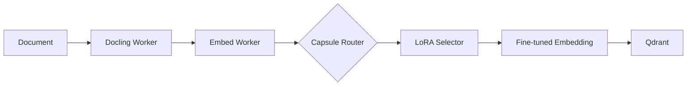

# Walkthrough: Agent Capsule Model System

## Summary

Built an **Agent Capsule Model** system that enables real-time LoRA weight selection for embedding fine-tuning based on document context.

## Architecture



## Components Created

### 1. Capsule Model Service

- **Path**: [services/capsule-model/](file:///c:/Users/eqhsp/.gemini/antigravity/knowledge/Qube/docling-cluster/services/capsule-model/)
- **API**: FastAPI service on port 8002
- **Features**:
  - Routing node evaluation
  - LoRA weight registry
  - Context-based LoRA selection

### 2. Schemas

- [capsule_v1.py](file:///c:/Users/eqhsp/.gemini/antigravity/knowledge/Qube/docling-cluster/schemas/capsule_v1.py)
  - `CapsuleModel`: Agent capsule with routing nodes
  - `RoutingNode`: Condition-based routing logic
  - `LoRAWeight`: LoRA weight metadata

### 3. Integration

- [embed-worker/worker.py](file:///c:/Users/eqhsp/.gemini/antigravity/knowledge/Qube/docling-cluster/services/embed-worker/worker.py)
  - Calls capsule API before embedding
  - Logs LoRA selection in ledger
  - Context-aware embedding generation

## Running the System

```bash
cd Qube/docling-cluster
.\scripts\deploy-local.bat
```

## Testing

```bash
# Run capsule model tests
python tests/test_capsule_model.py
```

## Routing Example

```python
# Medical domain routing
POST /route
{
  "text": "Patient diagnosed with hypertension",
  "context": {"domain": "medical"}
}

# Response
{
  "lora_id": "medical-v1",
  "confidence": 1.0,
  "node_id": "medical_route"
}
```

## Determinism

All routing decisions are logged in the ledger:

- `lora_id`: Which LoRA was selected
- `context`: Routing context
- `weights_hash`: LoRA or base model hash
