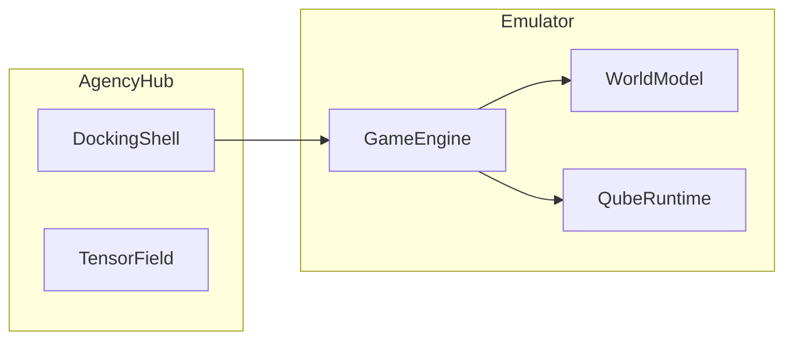

# Game Emulator for Runtime Models

Build a Python-based game emulator that mirrors the C++ runtime models (`WorldModel`, `QubeRuntime`) for agent training and testing.

## Proposed Architecture

## Proposed Changes

---

### Emulator Core

#### [NEW] [emulator.py](file:///c:/Users/eqhsp/.gemini/antigravity/playground/ghost-void/agency_hub/emulator.py)

Python implementation containing:

- `Tile`, `Vector2`, `AABB` dataclasses
- `WorldModel` class: level loading, tile management, spawn points, plane spawning
- `TokenPixel` dataclass: hash-chained execution unit
- `QubeRuntime` class: initialization, pixel execution, pattern docking, synthesis
- `GameEmulator` facade: combines WorldModel + QubeRuntime for unified API

---

### Integration Layer

#### [NEW] [runtime_bridge.py](file:///c:/Users/eqhsp/.gemini/antigravity/playground/ghost-void/agency_hub/runtime_bridge.py)

Abstract `RuntimeBridge` protocol that can load either:

- Python emulator (default, no dependencies)
- C++ native library via ctypes (when `libghostvoid.dll` is available)

---

## Verification Plan

### Automated Tests

- Unit tests for `WorldModel`: level loading, tile queries
- Unit tests for `QubeRuntime`: hash chain validation, pixel execution
- Integration test: full Observe → Normalize → Unify → Act cycle via `DockingShell`

### Manual Verification

- Run emulator interactively to verify state transitions
