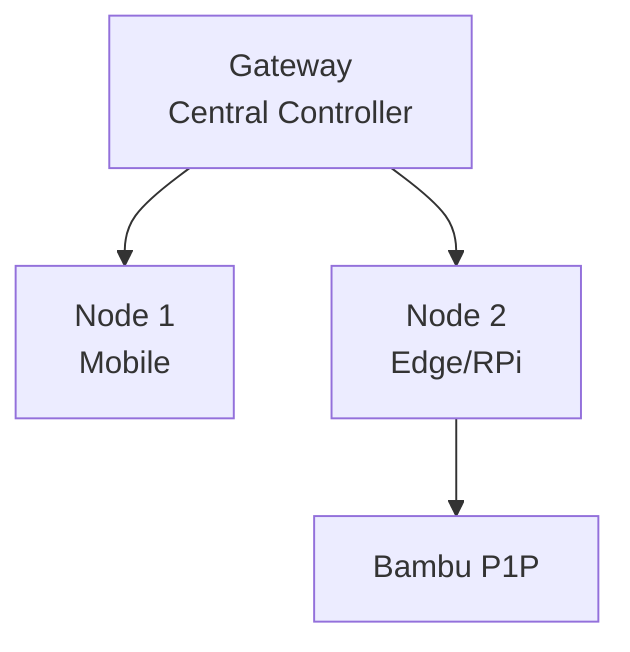

# OpenClaw QUBE Sovereign Deployment Walkthrough

## Summary

Deployed **OpenClaw** as production nervous system for QUBE Sovereign manifold with Bambu Panda 3D printing pipeline.

---

## Workspace Structure

```
~/.openclaw/
├── workspace/
│   ├── SOUL.md          # Identity manifold
│   ├── AGENTS.md        # Multi-agent roster
│   ├── TOOLS.md         # Skill configuration
│   ├── USER.md          # Owner config
│   └── memory.md        # Persistent state
├── exec-approvals.json  # Security allowlist
├── fly.toml             # Fly.io deployment
└── Dockerfile           # Container build
```

---

## Agents Configured

| Agent | Role |
| ----- | ---- |
| BambuPandaAgent | 3D printing orchestration |
| QubeSovereignAgent | Manifold chamber control |

---

## Next Steps

```bash
# Configure LLM providers
openclaw configure

# Approve hardware nodes
openclaw devices approve <requestId>

# Deploy to Fly.io
fly deploy
fly secrets set ANTHROPIC_API_KEY=...
```

---

## Node Architecture


